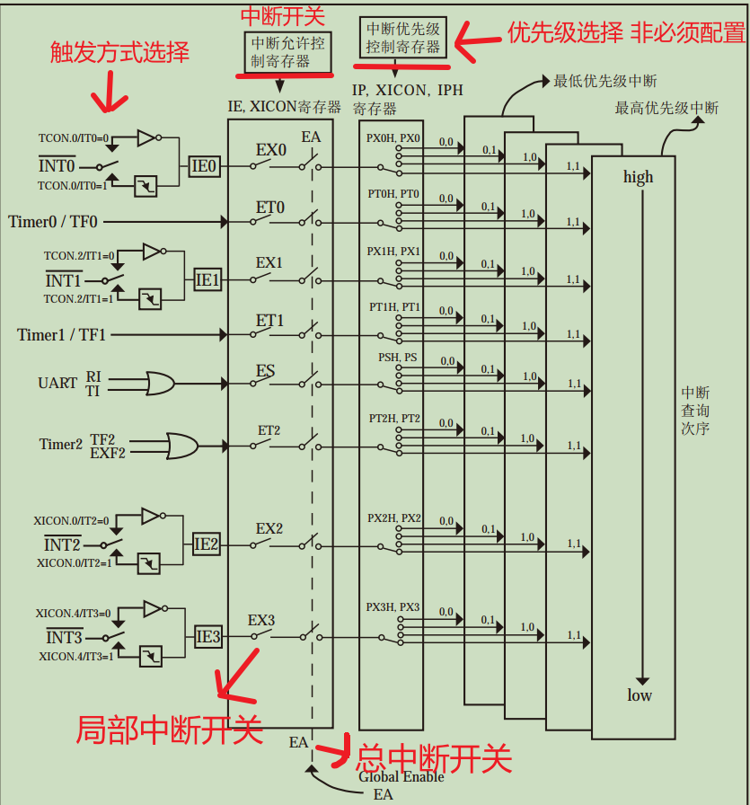
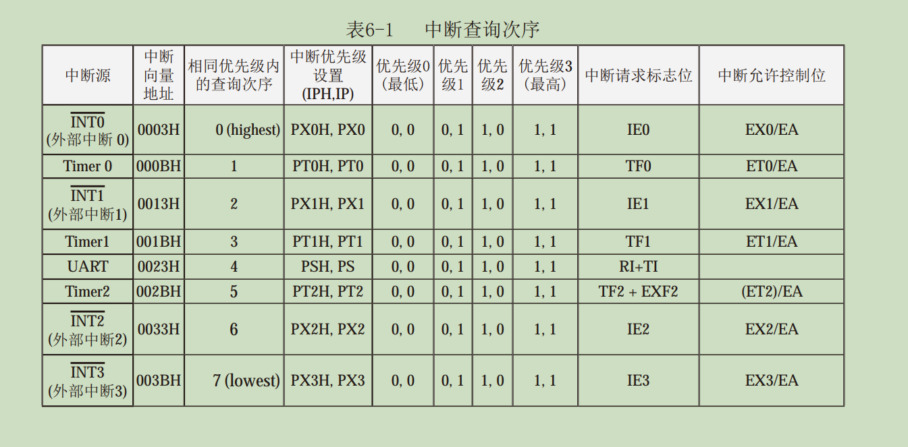

# 51单片机的中断

### 51的中断分为 外部中断INT0 INT1  定时器中断T0 T1和串口中断UART

### 要使用中断一般分为两个步骤 ：1.打开中断     2.写中断执行函数

### 中断的优先级由高到低（序号0-7）: 外部中断0 定时器中断0  外部中断1 定时器中断1 串口中断 定时器中断2  外部中断2  外部中断3

## 外部中断0：

### 1.外部中断0 打开(此部分一般放在main函数开头，也可以设置打开条件放在打开条件里， 下同): 

### void main（）

### {

### EA=1 ;

### EX0=1;  

### IT0=1;//下降沿触发（或IT0=0; //低电平触发）

### } 

### 2.中断函数 void INT0() interrupt 0 {  。。。}

注：1.函数名INT0 不是固定的 可自己命名   2.interrupt  后面数字为中断查询次序   

### 注： IT0=1 下降沿触发     IT0=0 低电平触发

如下图外部中断0是在P3^2口。所谓下降沿触发即 P3^2=1 P3^2=0 这个过程就触发了 外部中断0下降沿模式；     而低电平触发即：一旦P3^2=0就进入执行该外部中断函数0。

## 定时器中断0： 

### 1.打开：

### void main（）

### {

### EA=1；  

### TMOD=0x01； 

### TR0=1 ；  

### ET0=1 ；

### TH0= (65536-x)%256；   

### TL0 = (65536-x)/256 ；

### } （注：定时时间x为us   即（x/1000）  ms）

### 注：TMOD是选择计数记时模式 一般选择16位计数模式  即	TMOD=0x01

### 2.中断函数： void TIM0() interrupt 1

### {

### TH0= (65536-x)%256； 

### TL0= (65536-x)/256；     

### ······  

### }

### //因为定时器被清零所以要重新赋值

注：函数名TIM0 不是固定的 可自己命名

## 外部中断1：

### 1.打开:

### void main（）

### {

### EA=1；  EX1=1；  IT1=1（或IT0=0；）

###  }

### 2.中断函数 ：void INT1() interrupt 2 { }

注：1.函数名INT1 不是固定的 可自己命名    2.IT0=1 下降沿触发     IT0=0 低电平触发

## 定时器中断1 ： 

### 1.打开：

### void main（）

### {

### EA=1；   TMOD=0x01；  TR1=1；  ET1=1 ； 

### TH1=（65536-x）%256         

### TL1=(65536-x) /256 

###  }（注：定时时间x为x us   即（x/1000）  ms）

### 2.中断函数： void TIM1() interrupt 3

注：函数名TIM1不是固定的 可自己命名

## 串口中断UART（使用串口传输数据时使用）

### 1.打开： 

### void main（）

### {

### EA=1； ES=1； PCON=0x80；  SCON=0x80；      TI=1；

### }

### 2.中断函数： void UART() interrupt 4

拓展知识 中断标志位：单片机每执行完一次中断都需要清空 中断标志位 否则单片机会一直执行中断函数。

在外部中断 和 定时器中断 里51会自动帮我们清空。所以一般无需配置 

而在串口中断里需要主动清空标志位 TI    RI

